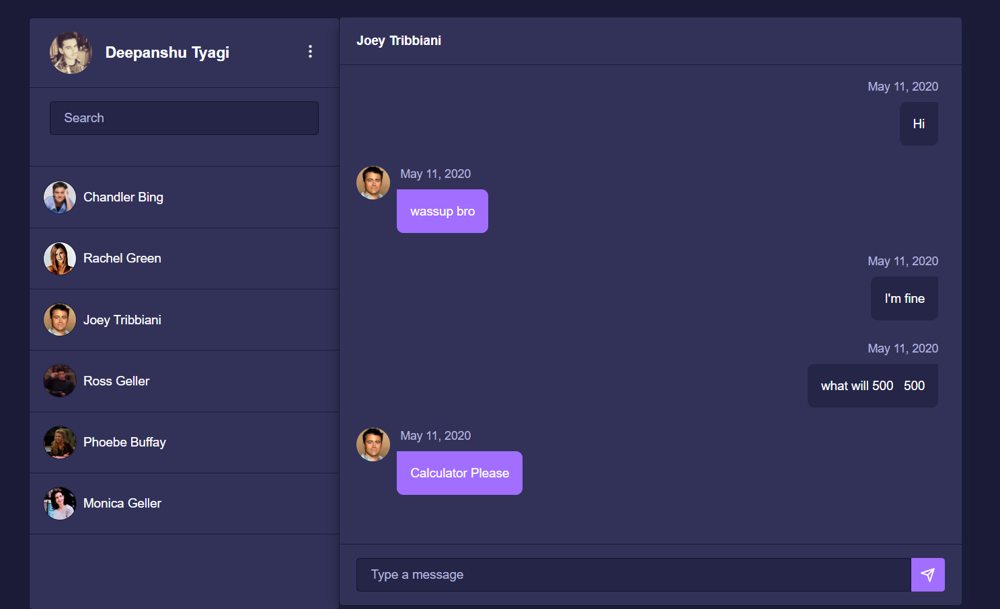
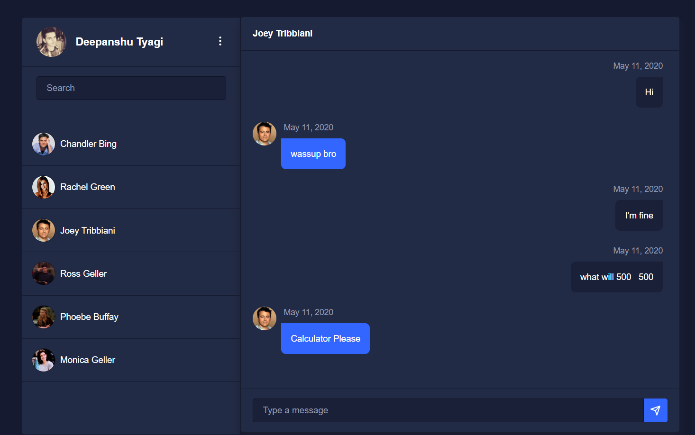
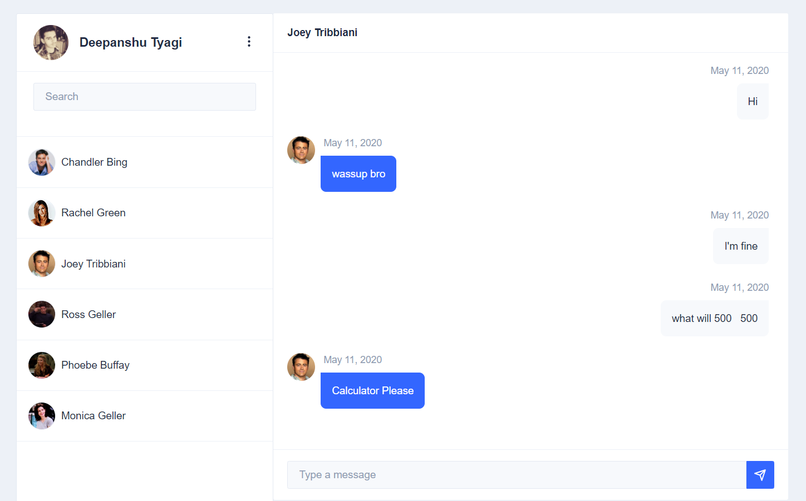

# Spring Angular Chat(STOMP)

1-1 instant messaging project designed to demonstrate WebSockets in a load-balanced environment. Users can register, login/logout, see a friendslist, private message all in realtime. WebSocket usages include user presence monitoring, notifications, and chat messages.

# Update Angular from 9 to 20

### Upgrade from Angular 9 to 20 Case Study
- Update guide: https://angular.dev/update-guide?v=9.0-20.0&l=3
- As a rule of thumb, keep node version greater than Angular version. Example: node version 12 and Angular version 10
- Use even numbered node versions(LTS) 
  
### Update 9 to 10
`nvm use 22` 
`npx @angular/cli@10 update @angular/core@10 @angular/cli@10`

***manual update:***
- "@angular/cdk": "^10.2.5"
- "@schematics/angular": "~10.2.4"
- "@nebular/eva-icons": "^6.2.1"
- "@nebular/theme": "^6.2.1"

`nvm use 12` 
`npm i`

### Update 10 to 11
`npx ng update @angular/core@11 @angular/cli@11`

***manual update:***
- "@stomp/stompjs": "^6.0.0"
- "sockjs-client": "^1.5.0"
- "@schematics/angular": "~11.2.14"

// below command also updates @angular/cdk to 11 
`npx ng update @nebular/eva-icons@7.0.0 @nebular/theme@7.0.0`

### Update 11 to 12
`npx ng update @angular/core@12 @angular/cli@12` 

// below command also updates @angular/cdk to 12 
`npx ng update @nebular/eva-icons@8.0.0 @nebular/theme@8.0.0` 

After nebular@8 update, below error started to appear: 
DEPRECATION WARNING: Using / for division is deprecated and will be removed in Dart Sass 2.0.0. 
Recommendation: math.div(nb-theme(stepper-step-index-width), 2) 
More info and automated migrator: https://sass-lang.com/d/slash-div 

***Above case fixed in nebular@9.0.0 which is compatible with Angular 13*** 
***So will not update to nebular@9.0.0 now, will continue to update Angular to 13 first, then update to nebular@9.0.0***

### Update 12 to 13
`nvm use 14` 
`npx ng update @angular/core@13 @angular/cli@13` 
// below command updates @angular/cdk to 13 
`npx ng update @nebular/eva-icons@9.0.0 @nebular/theme@9.0.0` 

***manual update*** 
- "@schematics/angular": "~13.3.11"

### Update 13 to 14
Below update required ng2-file-upload: 
`npx ng update @angular/core@14 @angular/cli@14`  

So tried below update, it automatically updated Angular version to 14!  
`npx ng update ng2-file-upload@3.0.0` 

Update remaining un-updated packages: 
`npx ng update @angular-devkit/build-angular@14 @angular/cli@14 @schematics/angular@14`

After `npx ng serve` command, below nebular sass compile error appeared: 

./node_modules/@nebular/theme/styles/prebuilt/dark.scss - Error: Module build failed (from ./node_modules/mini-css-extract-plugin/dist/loader.js): 
HookWebpackError: Module build failed (from ./node_modules/sass-loader/dist/cjs.js): 
SassError: Expected whitespace. 

Tried to update @nebular/theme to 10.0.0: 
`npx ng update @nebular/eva-icons@10.0.0 @nebular/theme@10.0.0`

Above command updated @nebular to 10 and @angular/cdk to 14

### Update 14 to 15
`nvm use 16` 
`npx ng update @angular/core@15 @angular/cli@15`

After this update below warning appeared: 
Deprecation This operation is parsed as:
    "Nebular Theme: `nb-theme()` cannot find value for key `" + $key + "` for theme `" + theming-variables.$nb-theme-name + " 

So, tried nebular theme update to 11: 
`npx ng update @nebular/eva-icons@11.0.0 @nebular/theme@11.0.0`

Above command updated @angular/cdk to 15

***manual update*** 
- "jasmine-core": "~4.5.0"
- "jasmine-spec-reporter": "~6.0.0"

After `npm i` got some ng2-file-upload - angular dependency errors, so updated ng2-file-upload also: 
`npx ng update ng2-file-upload@4.0.0 `

### Update 15 to 16
`nvm use 18` 
`npx  ng update @angular/core@16 @angular/cli@16` 
`npx ng update @nebular/eva-icons@12.0.0 @nebular/theme@12.0.0` 
`npx ng update ng2-file-upload@5.0.0` 

### Update 16 to 17 to 18
`nvm use 17` 
`npx ng update @angular/core@17 @angular/cli@17` 
`npx ng update @nebular/eva-icons@13.0.0 @nebular/theme@13.0.0` 
`npx ng update ng2-file-upload@6.0.0 `
`npx ng update @schematics/angular@17` 

After nebular 13 updated below error appeared: 

*node_modules/@nebular/theme/components/cdk/table/row.d.ts:39:5 - error TS2610: 'sticky' is defined as an accessor in class 'CdkFooterRowDef', but is overridden here in 'NbFooterRowDefDirective' as an instance property.*

So updated to nebular 14: 
`npx ng update @nebular/eva-icons@14.0.0 @nebular/theme@14.0.0` 

Above command also updated Angular from 17 to 18 :/

`npx ng update @angular/core@18 @angular/cli@18`

After these updates, ng2-file-upload dependency errors appeared: 
`npx ng update ng2-file-upload@7.0.0 `

After all above updates, SockJs import needed to be changed like this: 

From this: 
`import * as SockJS from 'sockjs-client';`

To this: 
`import SockJS from 'sockjs-client';`

As a result, updated from 16 to 17 to 18.

### Update 18 to 19
`nvm use 20` 
`npx ng update @angular/core@19 @angular/cli@19` 
`npx ng update @nebular/eva-icons@15.0.0 @nebular/theme@15.0.0` 

**After nebular 15 update, below errors appeared:** 

<i>Sass @import rules are deprecated and will be removed in Dart Sass 3.0.0.\
  
  More info and automated migrator: https://sass-lang.com/d/import

[WARNING] Deprecation [plugin angular-sass]

    src/themes.scss:2:8:
      2 │ @import '@nebular/theme/styles/themes/default';
</i>

Resolved changing **@import**  
`@import '@nebular/theme/styles/theming';` 

with **@use** 
`@use '@nebular/theme/styles/theming';`

After this, below directions have been applied: 
https://akveo.github.io/nebular/docs/design-system/enable-customizable-theme#enable-customizable-themes

### Update 19 to 20
Couldn't update to Angular 20, because latest nebular theme(v15.0.0) supports till Angular 19: 
https://github.com/akveo/nebular/releases

### Update bootstrap
`npx ng update bootstrap@5` 
After updating to bootstrap 5.3.7, needed to change `ml-*` and `mr-*` to `ms-*` and `me-*`

### Final update of remaning dependencies 
`npx ng update rxjs sockjs-client tslib @stomp/stompjs zone.js @schematics/angular @types/jasmine @types/jasminewd2 @types/node @types/sockjs-client jasmine-core jasmine-spec-reporter karma karma-chrome-launcher karma-coverage-istanbul-reporter karma-jasmine karma-jasmine-html-reporter protractor `

## Technologies/Design Decisions

- Backend: Spring Boot 2.2 with Kotlin 
- Frontend: Angular 19
- Database: MongoDB
- ORM: Spring Data Mongo
- WebSocket messaging protocol: Stomp
- WebSocket handler: Sock.js (with cross-browser fallbacks)
- Security: Spring Security
- Spring Controllers couple REST as well as WebSocket traffic
- Solid Design Principals.

## Build

#### Build and run client side(dev mode)

- Angular 19
- Nebular Theme 15 (https://akveo.github.io/nebular/)
- Bootstrap 5.3
- Serve 11 // http server
- ng2-file-upload
- sockjs-client & stompjs
- eva icons

`cd frontend` 
`nvm use 22` 
`npm i` 
`npx ng serve` 

#### Prod build
`npm install serve@11.3.0` // http server 
`npx ng build --prod` 
`cd dist/frontend` 
`npx serve -s -p 4200`

## Features

- OAUTH2 with Google and Facebook. Users can also register via email.
- Multiple color themes available.
- Private Friends list with blocking unwanted users.
- Messages are persisted. Pwa is available provide desktop application features.
- Offline message support and sync when user is online.
- Easy add new friends via email. Like WhatsApp add via Phone number.
- Chat support Images, Audio, Video, Gif's, Map Location. Multiple files with drop in feature.

## Themes

### Default Theme

### Dark Theme

### Light Theme

## Screenshots

- [Signin Screen](./images/signin.png)
- [Signup Screen](./images/signin.png)
- [Oauth2 Confirmation](./images/token.png)
- [Home Screen](./images/home.png)
- [Chat](./images/chat.png)
- [Add New Friend](./images/new_friend.png)
- [Edit Profile](./images.edit-profile.png)

## Any questions

If you have any questions, feel free to ask me:

- **Mail**: <a href="mailto:deepanshut041@gmail.com">deepanshut041@gmail.com</a>  
- **Github**: [https://github.com/data-breach/MlAgents](https://github.com/deepanshut041/friends-chat)
- **Website**: [https://data-breach.github.io/MlAgents](https://deepanshut041.github.io/friends-chat)
- **Twitter**: <a href="https://twitter.com/deepanshut041">@deepanshut041</a>

Don't forget to follow me on <a href="https://twitter.com/deepanshut041">twitter</a>, <a href="https://github.com/deepanshut041">github</a> and <a href="https://medium.com/@deepanshut041">Medium</a> to be alerted of the new articles that I publish
